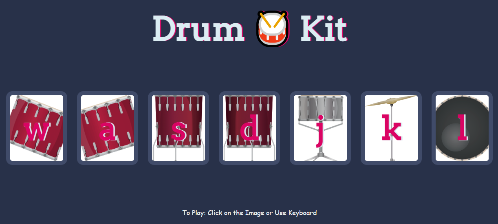

# Drum Kit

The Drum Kit is a basic web application that allows users to play different drum sounds by clicking on buttons or using keyboard shortcuts. It's a fun project for beginners to learn about event handling and audio playback in web development.

## Preview

## How to Play ?

To use the Drum Kit, simply checkout the deployed website [here](https://amit712singhal.github.io/Drum-Kit/)

- Click on the buttons labeled with the corresponding keys to play drum sounds.
- Alternatively, press the corresponding keys on your keyboard to trigger the drum sounds.

## Features

- Click on the buttons to play drum sounds.
- Use keyboard shortcuts to trigger drum sounds.
- Responsive design for easy use on different devices.
  
## Credits

This project was created as part of a [Web Development Course](https://www.udemy.com/course/the-complete-web-development-bootcamp/) on Udemy. Credits go to Dr. Angela Yu for providing guidance and resources.

## License

This project is licensed under the MIT License. See the [LICENSE](./LICENSE) file for more information.

